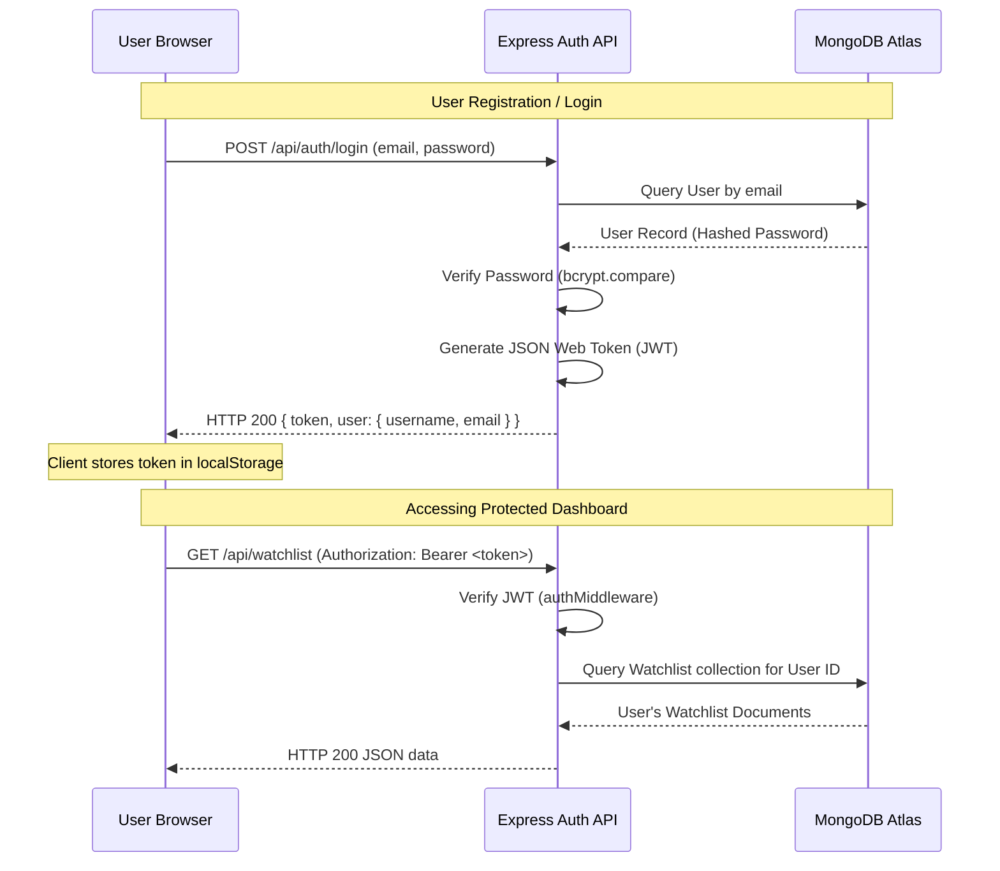
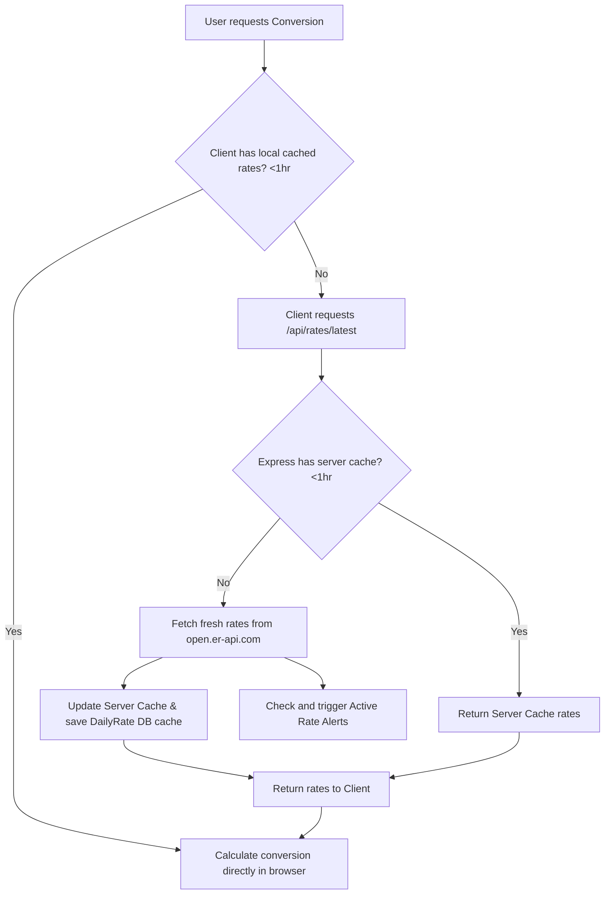

# ApexCurrency Analytics Platform

[](https://nodejs.org/)
[](https://expressjs.com/)
[](https://www.mongodb.com/cloud/atlas)
[](https://developer.mozilla.org/en-US/docs/Web/JavaScript)
[](https://render.com/)

A premium, production-ready Full-Stack Currency Analytics Platform. This application provides real-time currency conversions for over 150 currencies, historical trends (7-day and 30-day graphs), exchange rate statistics, custom user portfolios (watchlists), conversion history logs, and background rate alert triggers.

---

## ⚡ Quick Access

*   **Live Demo Link**: [https://currency-converter-f9pc.onrender.com](https://currency-converter-f9pc.onrender.com)
*   **GitHub Repository**: [https://github.com/kotamohan18-blip/currency-converter](https://github.com/kotamohan18-blip/currency-converter)

---

## 🎓 Project Submission Information

*   **Project Name**: ApexCurrency Analytics Platform
*   **Live Demo URL**: [https://currency-converter-f9pc.onrender.com](https://currency-converter-f9pc.onrender.com)
*   **GitHub Repository**: [https://github.com/kotamohan18-blip/currency-converter](https://github.com/kotamohan18-blip/currency-converter)
*   **Deployment Platform**: Render (Web Service)
*   **Database**: MongoDB Atlas (Cloud Cluster)
*   **Target Audits**: Suitable for internship applications, college course projects, and professional software engineering portfolio presentations.

---

## 💡 Why This Project?

This project was developed to address the engineering and UI challenges of building a responsive, real-time data analytical platform with personalized user profiles:

*   **Real-time Currency Conversion**: Computes instantaneous exchange rates across 150+ fiat currencies with local caching (reducing API call overhead and latencies).
*   **Historical Analytics**: Provides users with critical market trends (7-day and 30-day variations) mapped on interactive charts, offering visual intelligence over simple conversion tools.
*   **Secure User Authentication**: Allows individuals to sign up, securely log in, and customize accounts, demonstrating full JWT management and bcrypt password hashing.
*   **Favorites & Watchlists**: Enhances usability by letting users bookmark common currency pairs and compile personalized watchlists directly against USD live rates.
*   **Dynamic Rate Alerts**: Provides an automated background rate alert check (run hourly/intervals) to trigger toasts when exchange rates cross a user's defined thresholds.
*   **Full-Stack Architecture**: Demonstrates structured REST API separation, Mongoose schema validation, security protection middleware, clean static assets routing, and cloud deployment pipelines.

---

## 1. Project Overview

The **ApexCurrency Analytics Platform** is a full-stack web application designed for users who need comprehensive tools to track, analyze, and convert global currencies. It features a backend powered by **Node.js** and **Express.js**, connected to **MongoDB Atlas** as the cloud database for managing user accounts, conversion logs, custom watchlists, favorites, and alert settings.

The frontend is implemented using clean **Vanilla HTML5, CSS3, and JavaScript (ES6+)**, utilizing modern glassmorphic UI aesthetics, light/dark mode triggers, and responsive CSS variables. It is hosted together with the backend as a single service on **Render**, making the entire platform accessible immediately via a web browser.

---

## 2. Live Demo

The application is deployed on **Render** (Free Instance) and is fully interactive at:  
👉 **[ApexCurrency Live Demo](https://currency-converter-f9pc.onrender.com)**

> [!NOTE]  
> Since the project is deployed on Render's free tier, the application may take 50–90 seconds to wake up ("spin up") on initial load if it has been inactive. Once awake, it runs with standard performance.

---

## 3. GitHub Repository

The complete open-source codebase, version history, and setup assets are hosted at:  
👉 **[ApexCurrency GitHub Repository](https://github.com/kotamohan18-blip/currency-converter)**

---

## 4. Key Features

*   **Secure Authentication**: Secure register, login, profile management, and password updates backed by JSON Web Tokens (JWT) and `bcryptjs` hashing.
*   **Real-time Conversion**: Seamless conversion between 150+ world currencies utilizing cached rates from external APIs.
*   **Interactive Visualizations**: Beautiful Chart.js graphs mapping 7-day and 30-day historical currency value developments with active light/dark mode styling.
*   **Live Portfolios / Watchlists**: Track specific currencies against the USD in real-time on a unified dashboard widget.
*   **Saved Conversion Favorites**: Save commonly used currency pairs (e.g. `USD/INR`) to quick-access conversion cards.
*   **Active Threshold Rate Alerts**: Set thresholds (e.g. "Notify if `USD/INR` > 84.5") which trigger in the background and display toast alerts instantly upon dashboard login.
*   **Searchable History Logs**: View, search, and delete your complete past conversion transactions.
*   **Responsive Glassmorphism Styling**: Fully fluid layout adapts to desktops, tablets, and smartphones, sporting modern frosted-glass effects and animations.

---

## 5. Technologies Used

### Frontend
*   **HTML5 & CSS3**: Semantic page structures and dynamic styling using CSS Custom Properties (Variables), Flexbox, CSS Grid, and custom keyframe animations.
*   **Vanilla JavaScript (ES6+)**: Module-based scripting, asynchronous Fetch API requests, DOM manipulation, custom toast handlers, and state management.
*   **Chart.js**: Client-side canvas rendering library for producing currency trends.
*   **FontAwesome Icons**: Standard SVG vector icons for UI navigation.
*   **FlagCDN**: Integrated service for dynamically rendering national flag images matching country codes.

### Backend
*   **Node.js**: Asynchronous event-driven JavaScript runtime.
*   **Express.js**: Backend framework for implementing REST API endpoints, routing logic, static folder serving, and custom error handlers.
*   **Axios**: Promise-based HTTP client used to fetch third-party currency rates.

### Database
*   **MongoDB Atlas**: Cloud-hosted document database for storing schemas.
*   **Mongoose ODM**: Object Data Modeling library used to validate schemas and query MongoDB collections.

### Security & Authentication
*   **JSON Web Tokens (JWT)**: Used for secure user session token signing and route protection.
*   **bcryptjs**: Used to securely hash and compare passwords.
*   **CORS (Cross-Origin Resource Sharing)**: Restricts unauthorized external domains from calling backend API paths.

### External APIs
*   **ExchangeRate-API**: Provides real-time currency conversion rates.
*   **Frankfurter API**: Provides historical market exchange rate logs for rendering graphs.

---

## 6. Installation Steps

Follow these step-by-step instructions to download and install the project on your machine:

### Prerequisites
Make sure you have [Node.js](https://nodejs.org/) installed (v18.0.0 or higher recommended). You can verify your version by running:
```bash
node -v
```

### Setup Directory
1.  **Clone the Repository**:
    ```bash
    git clone https://github.com/kotamohan18-blip/currency-converter.git
    ```
2.  **Navigate to the Root Folder**:
    ```bash
    cd currency-converter
    ```
3.  **Install Dependencies**:
    Run the command below in the project root folder. This reads `package.json` and installs all necessary packages (Express, Mongoose, JWT, bcryptjs, etc.):
    ```bash
    npm install
    ```

---

## 7. Environment Variables Required

Create a new file named `.env` in the root folder of your project (parallel to `package.json`). Populate it with the following configuration details:

| Variable Name | Required | Default Value | Description |
| :--- | :--- | :--- | :--- |
| `PORT` | No | `5000` | The network port the Express backend server listens on. |
| `MONGODB_URI` | Yes | *None* | Connection string to your MongoDB Database (Local or Atlas Cloud). |
| `JWT_SECRET` | Yes | *None* | Cryptographic secret key used to sign and verify JSON Web Tokens. |
| `NODE_ENV` | No | `development` | Defines the environment mode. Set to `production` in live deployments. |

### Example `.env` file structure:
```env
PORT=5000
MONGODB_URI=your_mongodb_atlas_connection_string
JWT_SECRET=super_secret_jwt_key_12345
NODE_ENV=development
```

---

## 8. MongoDB Atlas Setup Guide

If you do not have a MongoDB database server running locally, follow these steps to set up a free database cluster on **MongoDB Atlas**:

1.  **Create an Account**: Go to [MongoDB Atlas](https://www.mongodb.com/cloud/atlas) and register for a free account.
2.  **Create a New Project**:
    *   Once logged in, click the Project dropdown in the top-left and select **New Project**.
    *   Name your project (e.g. `Currency Analytics`) and click **Next** -> **Create Project**.
3.  **Deploy a Free Database**:
    *   Click **Create** or **Build a Database**.
    *   Select the **M0** Free tier.
    *   Choose your preferred cloud provider (AWS/Google Cloud) and region (closest to you), then click **Create**.
4.  **Configure Database Security (Database Access)**:
    *   You will be prompted to create a database user.
    *   Enter a **Username** (e.g., `dbUser`) and a strong **Password**.
    *   Click **Create User**. *Remember these credentials as you will need them for your connection string.*
5.  **Configure Network Whitelisting (Network Access)**:
    *   Under the **IP Access List** section, add your IP address to allow your local machine to connect.
    *   *Note: If you plan to deploy to Render, you will need to allow access from anywhere by adding `0.0.0.0/0` to the whitelist.*
    *   Click **Add Entry**.
6.  **Retrieve Connection URI**:
    *   Once the cluster is created, click the **Connect** button on your Database dashboard.
    *   Select **Drivers** (Node.js).
    *   Copy the connection string. It will look like this:
        ```
        mongodb+srv://<username>:<password>@cluster0.xxxx.mongodb.net/?retryWrites=true&w=majority&appName=Cluster0
        ```
7.  **Apply credentials to `.env`**:
    *   Replace `<username>` with your database username.
    *   Replace `<password>` with your database user password (ensure any special characters are URL-encoded).
    *   Optionally specify a database name right before the `?` symbol (e.g. `/currency_platform`).

---

## 9. How to Run Locally

Once dependencies are installed and the `.env` file is configured with your MongoDB Atlas URI, you can launch the application:

### Run in Development Mode
This runs the application using `nodemon`, which automatically restarts the server when any backend file changes are saved:
```bash
npm run dev
```

### Run in Production Mode
This starts the backend directly with standard Node.js:
```bash
npm start
```

### Accessing the Web Application
Open your web browser and navigate to:  
👉 **[http://localhost:5000](http://localhost:5000)**

---

## 10. Production Deployment Information

To deploy this platform live to production using **Render** and **MongoDB Atlas**:

### 1. Push to GitHub
Ensure your code is committed (excluding the `.env` file via `.gitignore`) and pushed to your GitHub repository:
```bash
git init
git add .
git commit -m "Configure production release"
git remote add origin https://github.com/kotamohan18-blip/currency-converter.git
git branch -M main
git push -u origin main
```

### 2. Configure Render Web Service
1.  Log in to [Render](https://render.com/).
2.  Click **New +** -> **Web Service**.
3.  Connect your GitHub repository: `kotamohan18-blip/currency-converter`.
4.  Configure the environment details:
    *   **Name**: `currency-analytics`
    *   **Region**: Select the closest region to your MongoDB Atlas cluster.
    *   **Branch**: `main`
    *   **Runtime**: `Node`
    *   **Build Command**: `npm install`
    *   **Start Command**: `npm start`
5.  Expand the **Advanced** tab and add the Environment Variables:
    *   `MONGODB_URI` = `[Your Atlas MongoDB connection URI]`
    *   `JWT_SECRET` = `[A strong unique secret key]`
    *   `NODE_ENV` = `production`
6.  Click **Deploy Web Service**. Render will download, build, and serve your app.

---

## 11. Project Folder Structure

```
currency-converter/
├── backend/
│   ├── config/
│   │   └── db.js                 # MongoDB connection database setup using Mongoose
│   ├── controllers/
│   │   ├── authController.js     # User registration, login, profile edit controller
│   │   ├── ratesController.js    # Live rates retrieval, local caching, alerts checker
│   │   ├── historyController.js  # 7-day & 30-day chart trend history controller
│   │   ├── conversionHistoryController.js # CRUD handlers for past user conversions
│   │   ├── favoritesController.js# CRUD handlers for user-favorite currency pairs
│   │   ├── watchlistController.js# CRUD handlers for dashboard watchlist widget
│   │   └── alertsController.js   # CRUD handlers for currency rate thresholds
│   ├── middleware/
│   │   ├── authMiddleware.js     # Validates JWT tokens and protects private routes
│   │   └── errorMiddleware.js    # Handles standard errors and formatting
│   ├── models/
│   │   ├── User.js               # Database schema representing user profiles
│   │   ├── ConversionHistory.js  # Database schema for conversion log histories
│   │   ├── Favorite.js           # Database schema for pinned favorite conversions
│   │   ├── Watchlist.js          # Database schema for tracked currencies
│   │   ├── Alert.js              # Database schema for custom price threshold alerts
│   │   └── DailyRate.js          # Database schema for cached daily conversion values
│   ├── routes/
│   │   ├── authRoutes.js         # Map endpoints to authentication handlers
│   │   ├── ratesRoutes.js        # Map endpoints to rates/history queries
│   │   ├── historyRoutes.js      # Map endpoints to conversion log histories
│   │   ├── favoritesRoutes.js    # Map endpoints to favorites handlers
│   │   ├── watchlistRoutes.js    # Map endpoints to watchlist handlers
│   │   └── alertsRoutes.js       # Map endpoints to alert managers
│   └── server.js                 # Server startup entry file and background scheduler
├── frontend/
│   ├── css/
│   │   └── style.css             # Main stylesheet (themes, animations, variables, layout)
│   ├── js/
│   │   ├── api.js                # Core network request class, toasts, and UI helpers
│   │   ├── auth.js               # Validates forms for user signin/signup
│   │   ├── converter.js          # Chart rendering, conversion rates, and ticker UI
│   │   ├── dashboard.js          # Dashboard views (Watchlist, Favorites, Alerts, Log)
│   │   └── profile.js            # Profile updates and password editing controls
│   ├── index.html                # Main landing conversion dashboard page
│   ├── dashboard.html            # Protected user dashboard view
│   ├── login.html                # User login page
│   ├── register.html             # User registration page
│   └── profile.html              # Account details and settings page
├── .env.example                  # Environment template file
├── package.json                  # Node.js project meta and dependencies
└── README.md                     # Documentation markdown file
```

---

## 12. API Endpoints Documentation

All requests to the backend server are prefixed with `/api`. Protected routes require the client to supply a valid JWT within the request headers.

Header structure: `Authorization: Bearer <your_jwt_token>`

### 🔑 Authentication (`/api/auth`)
| Method | Endpoint | Access | Request Body | Response Success |
| :--- | :--- | :--- | :--- | :--- |
| `POST` | `/register` | Public | `{ username, email, password }` | `{ token, user }` |
| `POST` | `/login` | Public | `{ email, password }` | `{ token, user }` |
| `GET` | `/me` | Protected | *None* | `{ user }` |
| `PUT` | `/profile` | Protected | `{ username, email, password }` | `{ user }` |

### 📈 Rates & Trends (`/api/rates`)
| Method | Endpoint | Access | Query Parameters | Response Success |
| :--- | :--- | :--- | :--- | :--- |
| `GET` | `/latest` | Public | *None* | `{ source, base, rates, lastUpdated }` |
| `GET` | `/history` | Public | `?from=USD&to=INR&days=30` | `{ from, to, days, history: [...], stats }` |

### 📝 Conversion Logs (`/api/history`)
| Method | Endpoint | Access | Request Body | Response Success |
| :--- | :--- | :--- | :--- | :--- |
| `GET` | `/` | Protected | *None* | `[ { fromCurrency, toCurrency, fromAmount, toAmount, rate, date } ]` |
| `POST` | `/` | Protected | `{ fromCurrency, toCurrency, fromAmount, toAmount, rate }` | Saved conversion document |
| `DELETE` | `/clear` | Protected | *None* | `{ message: "History cleared successfully" }` |
| `DELETE` | `/:id` | Protected | *None* | `{ message: "History entry removed" }` |

### ⭐ Favorites (`/api/favorites`)
| Method | Endpoint | Access | Request Body | Response Success |
| :--- | :--- | :--- | :--- | :--- |
| `GET` | `/` | Protected | *None* | `[ { fromCurrency, toCurrency } ]` |
| `POST` | `/` | Protected | `{ fromCurrency, toCurrency }` | Saved favorite pair document |
| `DELETE` | `/:id` | Protected | *None* | `{ message: "Favorite removed" }` |

### 📊 Watchlist (`/api/watchlist`)
| Method | Endpoint | Access | Request Body | Response Success |
| :--- | :--- | :--- | :--- | :--- |
| `GET` | `/` | Protected | *None* | `[ { currencyCode } ]` |
| `POST` | `/` | Protected | `{ currencyCode }` | Saved watchlist document |
| `DELETE` | `/:id` | Protected | *None* | `{ message: "Currency removed from watchlist" }` |

### 🔔 Rate Alerts (`/api/alerts`)
| Method | Endpoint | Access | Request Body | Response Success |
| :--- | :--- | :--- | :--- | :--- |
| `GET` | `/` | Protected | *None* | `[ { fromCurrency, toCurrency, condition, value, isActive } ]` |
| `POST` | `/` | Protected | `{ fromCurrency, toCurrency, condition, value }` | Saved alert document |
| `DELETE` | `/:id` | Protected | *None* | `{ message: "Alert deleted" }` |
| `PUT` | `/:id/dismiss` | Protected | *None* | Updated alert document (`isTriggered` = false) |

---

## 13. Authentication Flow Explanation



1.  **Password Registration**: During register, `bcryptjs` creates a hash of the user password using a salt factor of 10. The plaintext password is never stored in the database.
2.  **JWT Signing**: On successful login, the server generates a token containing the user's database `_id` as the payload. This token is signed using the server's secret `JWT_SECRET` and is configured to expire in 30 days.
3.  **Client Session**: The browser catches the token and stores it in `localStorage`.
4.  **Route Authorization**: For protected pages (`dashboard.html`, `profile.html`), the script retrieves the token. If absent, the page redirects the user to `/login`.
5.  **Headers Validation**: For requests to protected API routes, the client includes the JWT in the `Authorization` header. The backend `protect` middleware decodes this header and fetches user details, attaching them to `req.user` for controller operations.

---

## 14. Currency Conversion Workflow Explanation

The conversion mechanism combines database caching and live fetch fallbacks to maximize speed and data availability:



1.  **Rate Fetching**: The platform requests rates relative to the base currency (USD).
2.  **Server Caching Layer**: To keep load times low and avoid API limit exhaustion, the backend caches exchange rates for 1 hour.
3.  **Database Cache**: Every successful new API request caches rates to the `DailyRates` collection on MongoDB Atlas.
4.  **Result Calculations**: The client fetches current rates, computes the difference, and updates the local DOM inputs dynamically.

---

## 15. Dashboard Features Explanation

The user dashboard provides key personalized widgets:

*   **Ticker Marquee**: A scrolling ticker displaying real-time exchange rates for popular currency pairs (e.g. `EUR/USD`, `GBP/USD`) against the current day's volatility metrics.
*   **Live Watchlist Widget**: A customizable grid listing tracked currencies. The widget fetches live prices for each checked code, display flags, and gives quick delete access.
*   **Favorites Panel**: Pins conversion pairs. Clicking a favorite pair immediately updates the index converter parameters automatically.
*   **Transaction Logs**: Shows conversion histories. Users can search logs by code, filter by dates, and delete items from history.

---

## 16. Historical Analytics & Charts Explanation

Users can click on **7-Day** or **30-Day** charts to view historical trend data.

1.  **Data Extraction**: When a user selects a currency pair (e.g., `EUR` to `INR`), the frontend calls `/api/rates/history?from=EUR&to=INR&days=30`.
2.  **API Fallback Pipeline**:
    *   The backend verifies if both codes are supported by the **Frankfurter API**. If supported, it retrieves true historical daily prices.
    *   If any currency is unsupported (e.g. niche or non-Frankfurter codes), the backend retrieves the current rate and generates a **deterministic random walk mock history** using a seed hashing algorithm based on the current date. This provides realistic chart developments without API failures.
3.  **Visualization Generation**: The frontend processes the historical price array and plots a line graph using **Chart.js** custom-styled for dark/light themes.

---

## 17. Favorites, Watchlist, and Rate Alerts Explanation

### Rate Alerts Implementation
The rate alert system allows users to set notification threshold values:
1.  **Creation**: A logged-in user saves an alert with target pair, condition (`GREATER_THAN` or `LESS_THAN`), and numeric value.
2.  **Background Checker**: The server runs an alert checker:
    *   On server startup (after 5 seconds).
    *   Every 10 minutes (cron schedule interval).
    *   Whenever rates are updated via `/api/rates/latest`.
3.  **Triggering Alerts**: The checker reads active alert thresholds. If rates cross the threshold, the backend marks the database record as `isActive = false` and `isTriggered = true`.
4.  **Client Notifications**: When the user opens their dashboard, the client pulls triggered alerts from `/api/alerts` and displays them as colorful toast notifications.

---

## 18. Security Considerations

*   **Safe Password Hashing**: Passwords are hashed using `bcryptjs` with auto-generated salts before database storage.
*   **JWT Protection**: All critical operations require token validation. Tokens are stored client-side in standard browser memory and verified server-side.
*   **Error Masking**: An Express custom error handler masks application file stacks when `NODE_ENV` is set to `production`, returning clean error messages instead of system folder paths.
*   **JSON Validation**: Mongoose validation blocks corrupt body structures, preventing database injection attempts.

---

## 19. Future Enhancements

*   **Email & SMS Notifications**: Integration of SendGrid or Twilio to email or text users the moment a rate alert triggers.
*   **Multi-Currency Trends**: Overlaying multiple currency lines on the same Chart.js canvas for comparative analysis.
*   **Cryptocurrency Conversions**: Add popular cryptocurrencies (BTC, ETH, SOL) using real-time price feeds.
*   **CSV Exports**: Allow users to download their conversion history logs in standard spreadsheet formats.

---

## 20. Troubleshooting Guide

### 1. Database Connection Timeout (`MongooseServerSelectionError`)
*   **Cause**: Your backend server cannot reach MongoDB Atlas. This is typically due to firewall restrictions.
*   **Solution**: Log in to your MongoDB Atlas account, navigate to **Network Access**, and ensure that your current IP address (or `0.0.0.0/0` for production) is whitelisted.

### 2. Node Server Fails to Start (`EADDRINUSE: port already in use 5000`)
*   **Cause**: Another application is currently listening on port 5000.
*   **Solution**: Either terminate the program currently running on port 5000, or edit the `PORT` variable in your `.env` file to another value (e.g., `PORT=5001`).

### 3. All dashboard features redirect to `/login`
*   **Cause**: Your client lacks a valid authentication token, or the JWT secret has changed on the server, invalidating your session.
*   **Solution**: Log in again. If the issue persists, clear the token from your browser by running `localStorage.removeItem('token')` in your console and reload the browser page.

### 4. Render Build Fails on Deployment
*   **Cause**: The folder structure or engine constraints are incorrectly matched, or files are missing.
*   **Solution**: Ensure your Render configuration is pointing to the root directory containing `package.json`. Make sure environment variables are declared in Render settings, not in an uploaded file.

---

## 21. Contributing Guidelines

We welcome contributions to improve the platform! To contribute:

1.  **Fork** the repository on GitHub.
2.  Create a new feature branch:
    ```bash
    git checkout -b feature/amazing-feature
    ```
3.  Commit your changes:
    ```bash
    git commit -m "Add some amazing feature"
    ```
4.  Push the branch to your fork:
    ```bash
    git push origin feature/amazing-feature
    ```
5.  Open a **Pull Request** explaining your modifications.

---

## 22. License

This project is licensed under the **MIT License**. You are free to modify, distribute, and utilize this project for personal portfolios, academic evaluations, or development practices.
